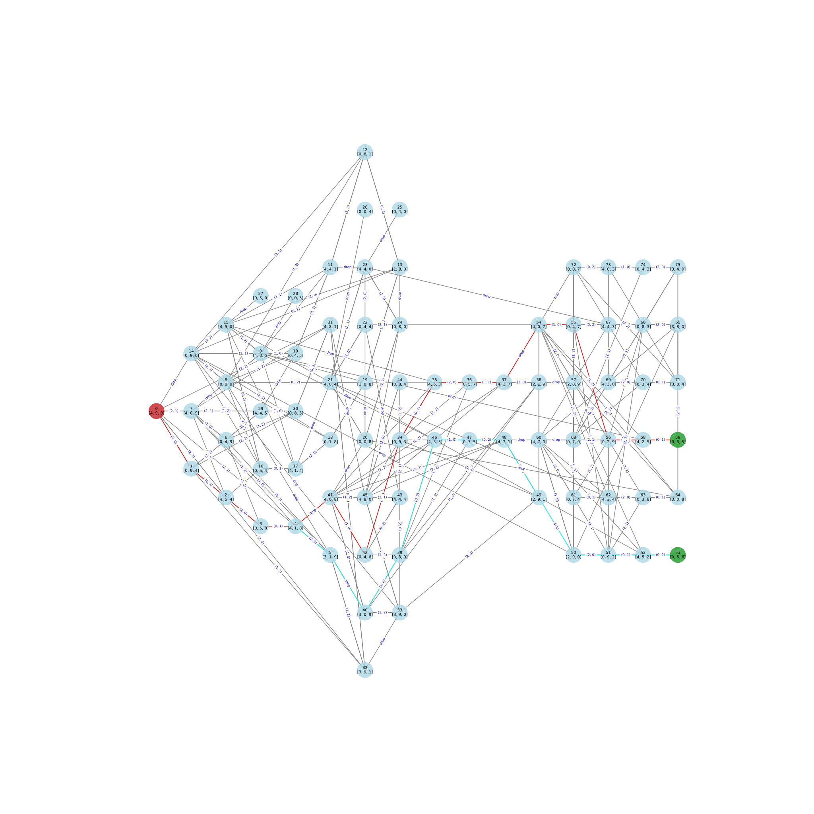

视频： https://www.bilibili.com/video/BV1ddXHYbEg4

花点时间去琢磨，让我的内心平静了一些

当没有考虑可以倒掉水的时候，我试图使用矩阵来计算，想通过泛函来分析

定义 i 导入到 j，则增量为

$$
\delta(i, j) = \begin{pmatrix}
  &\dots &\dots &\dots\\
  &\dots &-1_(ii) &\dots\\
  &\dots &\dots &\dots\\
  &\dots &1_(ij) &\dots\\
  &\dots &\dots &\dots\\
\end{pmatrix}
$$

所以导入的行为为：

$$
x' = x + \delta(i, j) \cdot x = (I + \delta(i, j)) \cdot x
$$

然而可能存在无法完全导入，则分为先导入然后将溢出的倒回去。如何处理溢出量：

定义容量为$c$，则溢出量为：

$$
o = \max(0, x' - c)
$$

倒回去的操作也就是：

$$
\delta(j, i)
$$

所以严格意义上的一个操作为$x_g$（g = guard）：

$$
\begin{aligned}
  x_g &= x' + \delta(j, i) \cdot o\\
  &= x' + \delta(j, i) \cdot \max(0, x' - c)\\
\end{aligned}
$$

于是有

$$
x_g = f_{ij}(x)
$$

找到这样一个路径

但是，需要将水倒掉，增加了困难，我就放弃了，直接暴力求解

## 基本思路

定义一个操作

$$
s' = f(s)
$$

如果$s'$在已知的图结构中，那么结束，如果不在，那么继续迭代直到找到停机状态


```python
def search(s):
    branches = list_all_operator(s)
    for (s_, op) in branches:
        if s_ in graph: continue
        graph.set(s_, op)
        if s_ == target: continue
        search(s_)
```

## png


## svg



